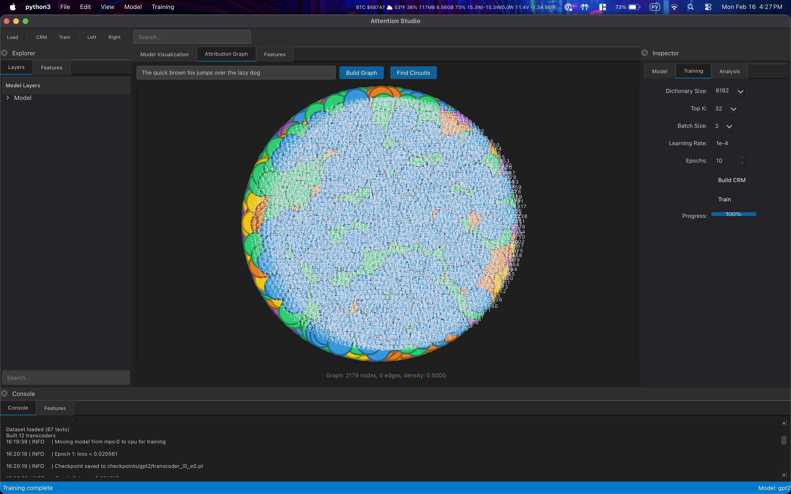
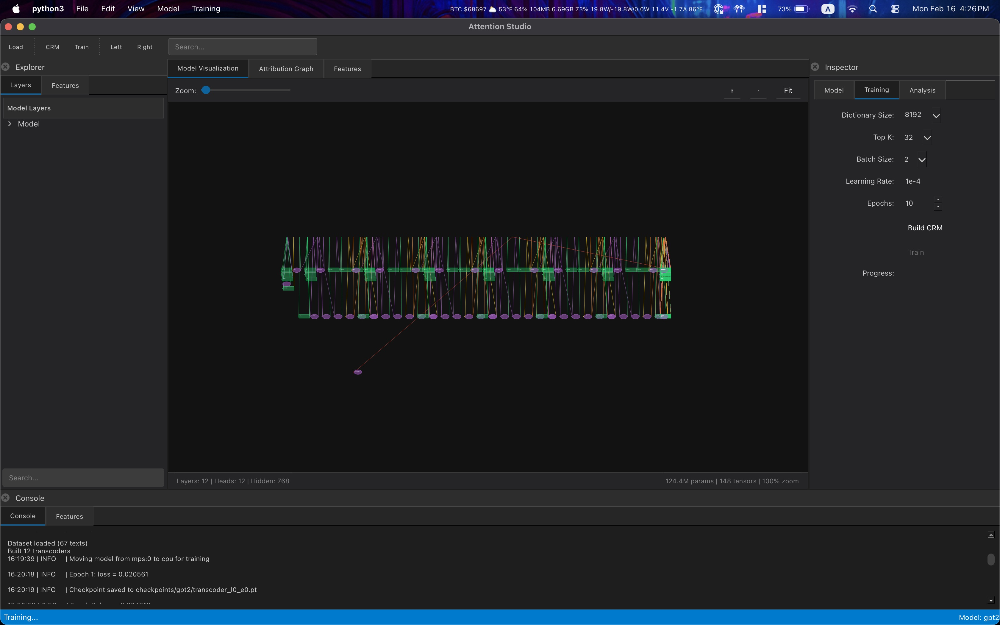

# AttentionStudio

Desktop application for visualizing and analyzing Large Language Model internals using Complete Replacement Models (CRM) methodology, based on [OpenMOSS research](https://interp.open-moss.com/posts/complete-replacement).

## Paper

**Bridging the Attention Gap: Complete Replacement Models for Complete Circuit Tracing**  
OpenMOSS Team, Shanghai Innovation Institute & Fudan University

Authors: Wentao Shu, Xuyang Ge, Zhaoxuan Song, Zhengfu He, Guancheng Zhou, Junxuan Wang, Rui Lin, Jiaxing Wu, Xipeng Qiu

Correspondence: xpqiu@fudan.edu.cn

## Features

- **Model Visualization**: Interactive visualization of transformer model architecture
- **CRM Training**: Train sparse autoencoders (Transcoders) on model activations
- **QK/OV Decomposition**: Analyze attention mechanisms using Lorsa decomposition
- **Feature Extraction**: Extract interpretable features from model hidden states
- **Attribution Graphs**: Build and visualize attribution graphs between features
- **Circuit Analysis**: Detect and analyze circuits (induction, copy, attention patterns)

## Requirements

- Python 3.10+
- PyTorch 2.0+
- Apple Silicon (MPS) or CUDA GPU recommended

## Installation

```bash
# Clone the repository
git clone https://github.com/miolini/attention-studio.git
cd attention-studio

# Install uv if you don't have it
curl -LsSf https://astral.sh/uv/install.sh | sh

# Create and activate virtual environment
uv venv
source .venv/bin/activate

# Install with development dependencies
uv pip install -e ".[dev]"
```

## Usage

```bash
# Run the application
uv run attention-studio
# or
uv run python -m attention_studio
```

### Quick Start

1. **Load a model**: Select GPT-2 (or other HuggingFace model) and click "Load Model"
2. **Build CRM**: Click "Build Transcoders" to create sparse autoencoders
3. **Train**: Select dataset and click "Train" to train the transcoder
4. **Analyze**: Use Features tab for feature extraction, Graph tab for attribution

## Screenshots





## Development

```bash
# Run tests
uv run pytest

# Run specific test file
uv run pytest tests/unit/test_crm.py

# Run with coverage
uv run pytest --cov=attention_studio --cov-report=html

# Lint
uv run ruff check .

# Type check
uv run mypy attention_studio/
```

## Architecture

- `src/attention_studio/core/`: Core business logic
  - `crm.py`: Transcoder and Lorsa implementations
  - `trainer.py`: CRM training
  - `feature_extractor.py`: Feature extraction and circuit analysis
  - `model_manager.py`: Model loading and management
  - `dataset.py`: Dataset handling
- `src/attention_studio/ui/`: PySide6 UI components
- `tests/`: Test suite

## License

MIT
